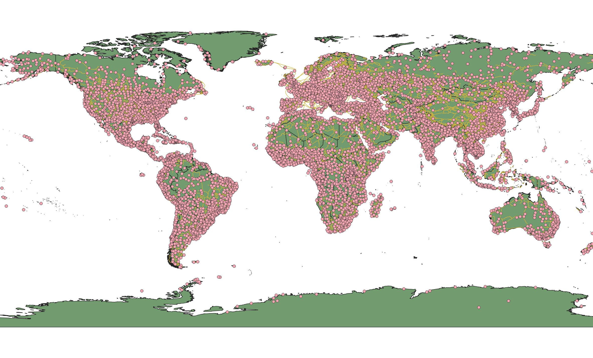

# Experiences in reading geospatial data from GeoPackage with Java
## Comparison of two Java geospatial tools

## Introduction

I'm a freshly graduated junior Java developer searching for solutions in my everyday work as a nature
conservationist. As a QGIS user, I work with GeoPackage databases every day. This short article was born
based on my curiosity.

[GeoPackage](http://www.geopackage.org/) is a popular format in open source GIS, especially since the
worthily widespread QGIS selected it as the default vector format in version 3.8. GeoPackage is a relatively
young format, as it was published in 2014. It is a platform-independent database implemented as an SQLite
container, which can
- store vector features
- tile matrix sets of imagery and raster maps
- attributes (non-spatial data)
- extensions.

There are many reasons why GIS users like storing their data in GeoPackage, and there are lots of use cases
when this isn't the best. It could be effective when you need to store spatial data locally, for example, on
mobile devices. However, discussing it is not my purpose now.

As a QGIS user, I like to use GeoPackages. As a junior Java developer, I spend much time elaborating to use
it simply in my codes. Java is not the best software language when you want to develop GIS-based
applications. Major GIS software (e.g. QGIS, ESRI ArcGIS) uses Python scripts. GIS experts nowadays
develop in Python to manipulate their datasets. Nevertheless, Java is a great language to implement
server-side, backend applications, where, sometimes, you have to work with GIS data. It is worth
it to handle GeoPackage effectively in your server. In my case, I have to import data from GeoPackage into
a PostGIS database regularly.

## GeoTools GeoPackage toolkit

A mature open source project. The first version was released in 1996. In 2007 the
[GeoTools](https://geotools.org/) Project Management Committee joined the 
[Open Source Geospatial Foundation](https://www.osgeo.org/) (OSGeo). As they are defined themselves, the
GeoTools Java code library provides standards compliant methods for manipulating geospatial data. The
library's core features are:
- Definition of interfaces for key spatial concepts and data structures
- A clean data access API supporting feature access, transaction support
- A stateless, low memory renderer
- Schema assisted parsing technology

The library supports a wide range of raster (arcgrid, GeoTIFF, jpeg, MatLab, etc.) and vector (GeoPackage,
PostGIS, shape, MySQL, geojson, csv, etc.) formats. It provides support for numerous
[Open Geospatial Consortium](https://www.ogc.org/) standards.

The library was released under the LGPL license.

## NGA GeoPackage artefact

The [National Geospatial-Intelligence Agency](https://www.nga.mil/) (NGA) is a governmental institute in
the United States which provides, among others, marine safety products, historical maps, and small business
resources.

It provides the ability to read, create and modify GeoPackage files. As you can see, it's specifically for
GeoPackage manipulation. Your possibilities are narrower, as it cannot handle other GIS databases or files
and didn't implement more functions.

The Git repository of the NGA's geopackage-java library:
[https://github.com/ngageoint/geopackage-java](https://github.com/ngageoint/geopackage-java)

It was released under MIT license.

## Method

I implemented a class for each library to read layers from the same gpkg. These classes create POJO
instances. I wasn't preoccupied with the question of how to write data into GeoPackage. My purpose was to
write a data reader class as simple as possible. I created repeated test cases with Junit5 to measure the
running time. I didn't make a deep statistical analysis or monitor the computer resources.

### Environment

I run test cases on my desktop computer:
- Intel(R) Core(TM) i7-7740X CPU
- 16,0 GB RAM
- SSD

I used the software below: 
- Windows 10 21H2 64 bit
- Oracle OpenJDK 17.0.2
- Apache Maven 3.8.4
- IntelliJ Idea Community Edition 2021.3.3
- QGIS 3.22.3 (1628765ec7) for data preparation

### Dataset

I used three layers from the 1:10M [Natural Earth Data](http://www.naturalearthdata.com/downloads/),
downloaded on 30.03.2022. The point layer is the cities, the line layer is the roads, and the polygon layer
is the countries. I kept only a text and an integer field for each layer. I exported the prepared data with
QGIS to a new GeoPackage.

## Experiences

The documentation was quite enough to understand the basics in both cases. Each tool has Javadoc. The
GeoTools library has a long and detailed tutorial, while the NGA's one has a short but clear readme markdown
in their git repository. The implementation is the same in the case of both libraries, which is
similar to Java JDBC. You have to create a connection, a statement contains a query then you get a result
set. The NGA's library has a much lesser dependency. The maven pulls 7 third party libraries and 11 from
mil.nga, while the other pulls 87 third parties and 20 from org.geotools.

None of them used the AutoClosable interface, therefore you can't implement the methods in a
try-with-resources statement. The GeoTools implementation is a little more complicated. You will meet a lot
of checked exceptions. However, the reader class implemented with the NGA artefact is shorter, and the code
is more readable. In the code, I prepared a POJO for the layer. It has an integer attribute for the
coordinate reference system, storing the [EPSG](https://epsg.org/home.html) identifier. Object stores
the geometry as a [WKT string](http://wiki.gis.com/wiki/index.php/Well-known_text). The class has a long id,
a String and an integer attribute for the fields in the layer's table. The repeated test cases based on NGA
implementation classes run much faster on my computer, you can see in the following table:

| Library  | Value  | Point layer | Polyline layer | Polygon layer | All layers |
|----------|--------|-------------|----------------|---------------|------------|
| GeoTools | Sum    |             |                |               |            |
| GeoTools | Mean   |             |                |               |            |
| GeoTools | Median |             |                |               |            |
| NGA      | Sum    |             |                |               |            |
| NGA      | Mean   |             |                |               |            |
| NGA      | Median |             |                |               |            |

## Conclusion

Both of the libraries are great, well documented and easy to understand the usage. Nevertheless, often the
less is more. The NGA's simple tool is easier to use, faster, and has less dependency. If I need to read
the GeoPackage layer I will use the NGA's library. If I have to use other tools (I have to handle other
formats, databases etc.), I will maybe use the slower, more complicated GeoTools library in my code.
